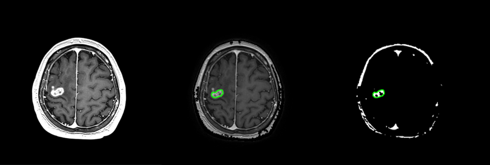
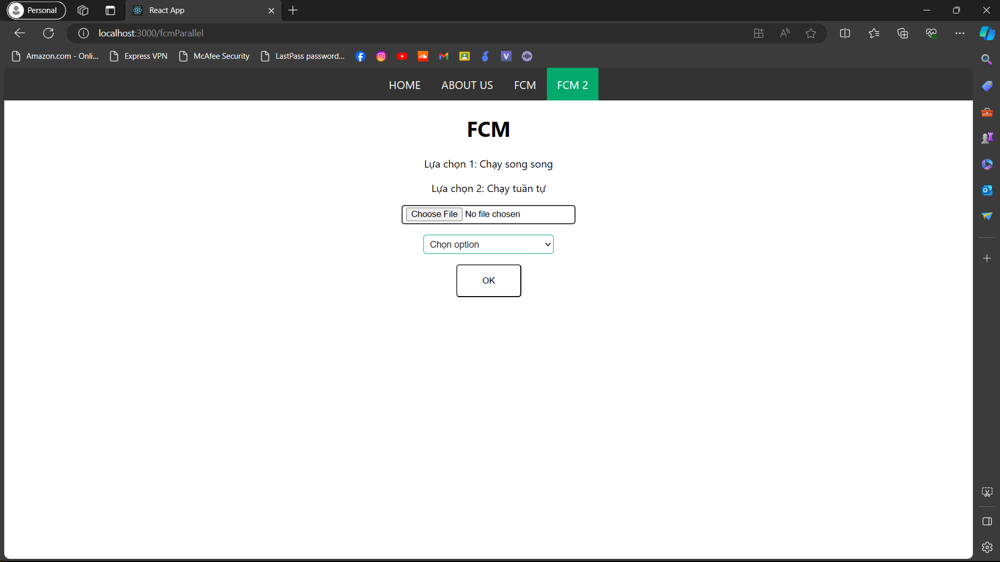
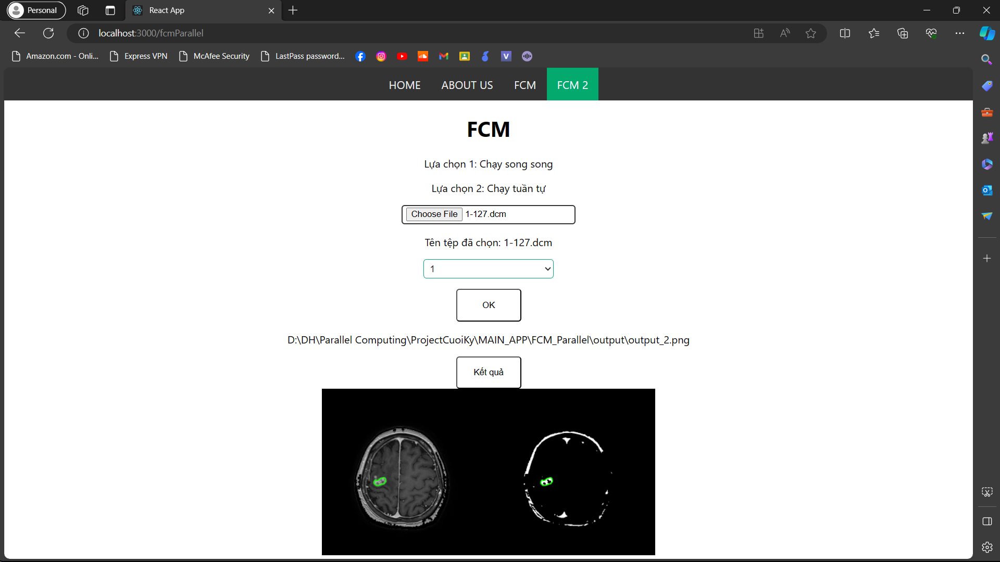

# Parallel-Computing-App

HƯỚNG DẪN CHẠY CHƯƠNG TRÌNH

I. Cài đặt ứng dụng:
1. Cài đặt NPM:
- Bước 1: Vào trang chủ của [nodejs](https://nodejs.org/en)
- Bước 2: Tải phiên bản được khuyên dùng (nút bên trái)
- Bước 3: Cài đặt chương trình

2. Cài đặt chương trình:
- [Truy cập vào link Github](https://github.com/ngocanhh1412/Parallel-Computing-App)
- Download project về máy, giải nén và làm theo hướng dẫn bên dưới

## Nếu có ứng dụng của Git trên máy
```bash
git clone https://github.com/ngocanhh1412/Parallel-Computing-App
```

## Môi trường ứng dụng
Có 2 cách để cài các thư viện cần thiết của ứng dụng: sử dụng Anaconda (khuyên dùng) hoặc dùng CUDA toolkit của NVIDIA

## Cách 1: Dùng Anaconda:
Dùng lệnh:
```bash
conda install (các thư viện đã được liệt kê trong file libraries.txt cùng các phiên bản nên cài)
```
Cài thêm thư viện cudatoolkit:
```bash
conda install -c anaconda cudatoolkit
```

## Cách 2: Dùng CUDA toolkit và môi trường pip
Cài đặt [CUDA toolkit](https://developer.nvidia.com/cuda-downloads)

Sau đó mở terminal ở thư mục project đã tải và chạy lệnh:
```bash
pip install -r libraries.txt
```

## Các thư viện NPM cần có
Mở terminal ở thư mục "main-app" và chạy các lệnh sau:
```bash
npm install axios
npm install react
npm install react-dom
npm install react-router-dom
```

Trong trường hợp đã cài các thư viện trên, nếu không khởi động server được và báo lỗi thì xoá thư mục "node_modules" và chạy lệnh:
```bash
npm install
```
Sau đó cài lại các thư viện trên.

II. Sử dụng ứng dụng:
1. Về ứng dụng:
- Ứng dụng có 2 features: FCM và FCM2
- FCM là chương trình phát hiện u não dùng thư viện có sẵn
- FCM 2 là chương trình phát hiện u não do nhóm tự thiết kế
- Ứng dụng sẽ phát hiện u não và tô màu khối u


2. Thiết lập:
- Trước tiên người dùng cần cài các thư viện cần thiết đã liệt kê ở trên
- Về input:
    + Chương trình sẽ nhận file ảnh y tế DICOM nên file cần có dạng ".dcm"
    + Hãy đưa ảnh MRI muốn xử lý vào folder "img" 
    + Nếu muốn dùng chương trình FCM, hãy đưa ảnh vào folder "FCM/img", còn FCM 2 thì đưa vào folder "FCM_Parallel/img"
    + Trong folder img của cả 2 chương trình đã có sẵn 4 file DICOM MRI chứa u não
- Về output:
    + Sau khi nhận ảnh và xử lý, chương trình sẽ lưu ảnh mới
    + Trước khi dùng, người dùng cần phải thiết lập folder output để chương trình lưu ảnh vào
    + Trong folder FCM sửa nội dung của file .env: OUTPUT_PATH = (Đường dẫn thư mục output mong muốn) để lưu kết quả cho chương trình FCM
    + Tương tự cho chương trình FCM 2, sửa file .env: OUTPUT_PATH2 = (Đường dẫn thư mục output mong muốn)
    + Người dùng có thể sử dụng 2 folder "FCM/output" và "FCM_Parallel/output" đã được tạo sẵn

3. Dùng ứng dụng:
- Bước 1: Khởi động ReactJS và FastAPI:
    + Mở terminal tại folder "main-app", nhập: 
    ```bash
    npm start
    ```
    + Mở terminal tại folder "FCM", nhập: 
    ```bash
    uvicorn app:app --port 8000
    ```
    + Mở terminal tại folder "FCM_Parallel", nhập:
    ```bash
    uvicorn app:app --port 8001
    ```
- Bước 2: Tương tác với giao diện: 
    + Thanh điều hướng ở trên cùng có 4 nút: Home, About us, FCM và FCM 2. 
    + Hướng dẫn này sử dụng chương trình FCM 2
    
    + Ấn nút "Choose file" để chọn file ảnh MRI muốn xử lý và lựa chọn file trong folder "FCM_Parallel/img"
    + Lựa chọn bên dưới: 1 là chạy song song, 2 là chạy tuần tự
    + Sau đó ấn nút "OK" và đợi vài giây để chương trình xử lý
    + Khi chương trình xử lý xong, in ra màn hình tiếp theo là đường dẫn đến ảnh mới, cùng nút "Kết quả"
    + Khi ấn nút "Kết quả", ảnh mới đã được xử lý đó sẽ được in ra màn hình
    
    + Để dùng chương trình FCM, chọn file trong folder "FCM/img", không cần bước chọn option, còn lại chạy giống như trên